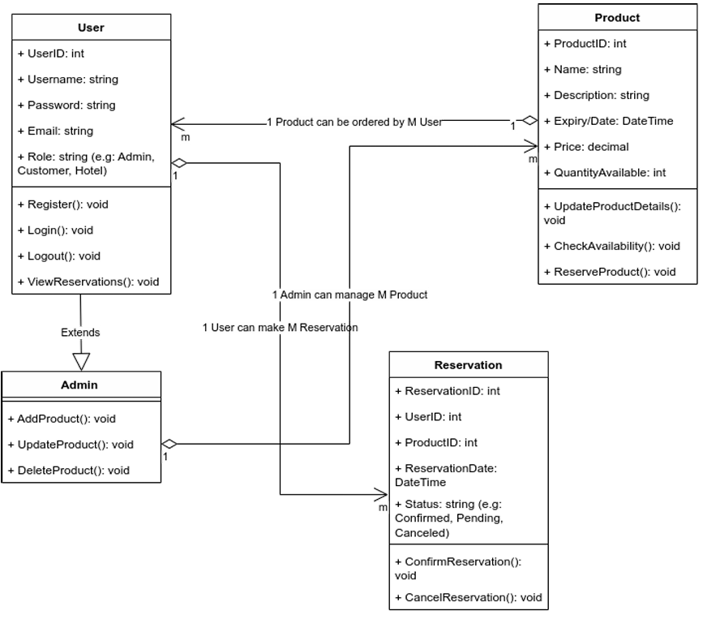

# 🥗 **Dibuang-Sayang** 🌱
## **Jangan Dibuang, Sayang!**

### 🌍 **Solusi untuk Limbah Makanan di Hotel** 🌍
Kami adalah Kelompok **Dibuang Sayang** yang berkomitmen untuk mengurangi limbah makanan di hotel melalui inovasi teknologi. Aplikasi kami bertujuan untuk menyelamatkan makanan yang hampir dibuang dan memberikan manfaat kepada masyarakat.

---

### **🔍 Analisis Pareto: Fokus pada Masalah Utama** 

Untuk mengatasi limbah makanan di hotel, kami menggunakan **Analisis Pareto** untuk mengidentifikasi dan memprioritaskan penyebab utama.

**Data & Temuan:**

- **Porsi Berlebihan:** 🌟 Menyumbang **40%** dari total limbah. 
- **Bahan Makanan Tidak Terpakai:** 📦 Menyumbang **30%** dari total limbah.
- **Sisa Makanan Tamu:** 🍽️ Menyumbang **20%** dari total limbah.
- **Lain-lain:** 🔄 Menyumbang **10%** dari total limbah.

### **💡 Solusi Prioritas:**
1. **Aplikasi "Dibuang Sayang":** 📱 Menyediakan platform untuk menjual makanan yang mendekati kadaluarsa dengan harga diskon.
2. **Standarisasi Porsi Makanan:** 📏 Mengembangkan panduan porsi yang sesuai untuk tamu.
3. **Pengelolaan Bahan Makanan:** 🗂️ Implementasi sistem inventaris yang lebih ketat.

### **Class Diagram**

---

### **👥 Kelompok Dibuang Sayang**
- **Ketua Kelompok:** 
- **Anggota 1:** Benaya Imanuela - 22/494790/TK/54313 (Backend Developer)
- **Anggota 2:** Muhammad Hilmi Dzaki Wismadi - 22/497591/TK/54539 (Software Architect)
- **Anggota 3:** Sulaiman Fawwaz Abdillah Karim - 22/493813/TK/54120 (Frontend Developer)

Mari bersama kita kurangi limbah makanan dan bantu mereka yang membutuhkan! 🌾🌍

